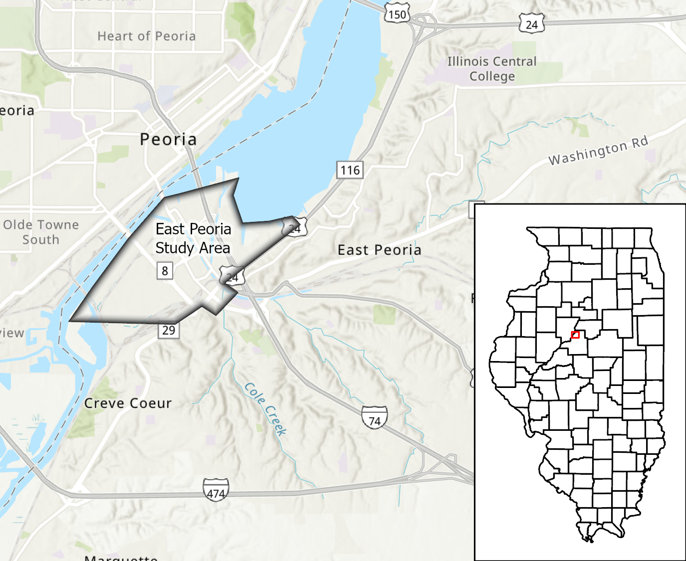

```{r library, include=FALSE}
library(DT)
library(ggplot2)
library(dplyr)
library(tidyverse)
library(kableExtra)
library(knitr)
opts_knit$set(eval.after = "fig.cap")
library(latexpdf)
library(colorspace)
```

```{r source_functions, include=FALSE}
source("StructureDamagebyCommunity.R")
source("KableStructureDamagebyCommunity.R")
source("KableStructureDamageByCommunityNonRes.R")
source("KableStructureDamageByCommunityRes.R")
source("StructureBuildingDamagebyCommunityBoxPlot.R")
source("StructureContentDamagebyCommunityBoxPlot.R")
source("StructureInventoryDamagebyCommunityBoxPlot.R")
source("render_toc.R")
```

```{r options, include=FALSE}
options(knitr.table.format = "latex")
options(tinytex.verbose = TRUE)
```

```{r subset_loss_data_for_community, include=FALSE}
ld <- params$loss_data
community_losses <- ld[ld$StudyCity == params$communityname, ]
```

&nbsp;
&nbsp;
``` {r echo=FALSE, out.width = "60%", fig.align = "center"}

```
&nbsp;
&nbsp;

```{r toc, include=FALSE}
render_toc("Community_Loss_Report.Rmd")
```

# Executive Summary
Flooding is a major threat to people, property, and infrastructure in Illinois. Communities can increase their resilience to flooding disasters and lessen losses by reducing the number of structures at risk of flooding. State and federal grant programs can be used to relocate, elevate, or purchase and demolish at-risk structures. Identifying structures with the greatest risk will assist in prioritizing projects that will have the greatest impact on reducing losses. High-quality flood damage estimates on a structure-by-structure basis provide the needed information on which to focus flood loss reduction programs. A structure-by-structure risk assessment provides information that identifies which structures flood, what frequency of flood impacts each structure, the depth of flooding, and the expected losses associated with each event. Answers to these questions help a community understand their flood risk and strategically plan where and how to best deploy resources to anticipate and reduce flood risks. Local responders can use the information to identify where, when, and how severely structures may flood. The Illinois Natural Hazard Mitigation Plan of 2018 identifies the development of structure-specific risk assessments as an action item to improve mitigation planning.

The Illinois Department of Natural Resources/Office of Water Resources (IDNR/OWR), the Illinois State Water Survey (ISWS), and the U.S. Army Corps of Engineers (USACE) Silver Jackets Program are collaborating to develop structure-specific risk assessments across Illinois. Funding for the effort has been provided by the Illinois Department of Natural Resources and USACE Silver Jackets.

Structure-specific flood risk assessments completed in Illinois through this collaborative effort are made available on the Structures at Flood Risk (SAFR) website. The intended audiences for the website are state and local officials and agency staff and, in particular, floodplain managers, mitigation officers, and city planners.

The data used in the studies are time sensitive. The date of source data and when the study was performed is provided and should be taken into consideration when using the information.  There are uncertainties and assumptions necessary to perform the analyses. Section 3: Uncertanties in Data and Results should be consulted before using the information. Every effort has been made to use a consistent methodology for the analyses; however, best practices may change over time. The user should consult the accompanying reports for the geographic area of interest and details of the analysis.


# Introduction: `r params$communityname`, IL
This report has been prepared for `r params$communityname`, IL to communicate the results, methods and potential data applications of a Structural Flood Risk Analysis. The project was an inter-agency collaboration including the IDNR/OWR, the ISWS, and the USACE - Rock Island District (MVR) funded through the USACE Silver Jackets Program and IL DNR. Work began in January 2023 and was completed in May 2024. The study area included 525 structures in East Peoria within or near to the 0.2% Annual Chance Exceedence (ACE) flood extent (equivalent to the 500-year flood), and were surveyed and assessed for their potential to incur direct flood damages at probabilistic flood recurrence intervals.

``` {r echo=FALSE, out.width = "80%", fig.align = "center", fig.cap='Study Location'}

```


## The Silver Jackets Program 
The Silver Jackets Program provides a formal and consistent strategy for an inter-agency approach for planning and implementing measures to reduce the risks associated with flooding and other natural hazards. State-led Silver Jackets teams bring together multiple state, federal, and local agencies to learn from one another, facilitate collaborative solutions, leverage resources, and reduce flood risk and other natural disasters. Within USACE, the Silver Jackets Program facilitates the implementation of its Flood Risk Management Program at the state level. USACE established the Flood Risk Management Program to work across the agency to focus its policies, programs, and expertise and to align USACE activities with counterpart activities of other federal, state, regional, and local agencies in order to manage and reduce flood risk.


## Project Background
This Silver Jackets funded study is a continuation of the work started by the OWR to develop a comprehensive structure inventory within the State's floodplains with the intent  to better understand and mitigate the State's exposure to flood risk. The methods used were developed by OWR and  ISWS in conjunction with FEMA and have been successfully applied to flood prone communities across the state. These methods allow for integration of the results into the Structures At Flood Risk (SAFR) web mapping application developed by ISWS. This web application allows users to view and query individual structures to better understand the structure's risk of being flooded and the specific damages and loss that would be experienced. In addition to meeting specific state level goals, the results of this study can be used by communities to better understand their local flood risk and associated impacts, and to then make data-driven decisions about mitigation strategies.


## Project Objectives
The specific objectives of this project were to: 

1. Develop the information and data required to perform a detailed structure based flood risk analysis. 
2. Perform the analysis according to the methods laid out by the ISWS and OWR.
3. Provide the resulting data sets to the State for integrating into the SAFR application.
4. Communicate the results and furnish data sets to each community included in the project.

These specific objectives meet the State of Illinois' goal to develop a comprehensive statewide floodplain structure inventory. They meet the goal of the Silver Jackets program to collaboratively work to reduce flood risk through better informed floodplain planning. Further, they enable communities - through detailed, structure level data - to better understand and quantify their flood risk, leading to strategic mitigation planning and implementation.


# Technical Approach and Methods

To create information and data sets that could be used to better understand and quantify risk, the technical approach developed by ISWS and FEMA was adopted and can be considered a Hazus Level 2 analysis. Hazus is a Geographic Information System (GIS)-based natural hazard analysis software tool, developed and maintained by FEMA, which applies standardized methodologies to quantify a variety of impacts from natural disasters, including flooding. A Hazus Level 2 analysis is a common term used to describe a Hazus analysis that improves both the default hazard information (flood depth grids) and default inventory data (structure inventory). This approach includes the following components:

1. Build a detailed structure inventory using field survey data and best available building valuations.
2. Create flood depth grids at specific annual chance exceedence probabilities of 0.2%, 0.5%, 1%, 2%, 4% and 10%, corresponding to the 500-year, 200-year, 100-year, 50-year, 25-year and 10-year floods, respectively.
3. Using industry standard depth-damage curves, estimate structure damage from each flood exceedence probability.
4. Use the damage estimates to calculate structure, content or inventory losses in dollars.
5. Extend the analysis by determining a structure's overall flood risk and flood risk over a 30-year period.
6. Present the results in the SAFR web application and generate reports and maps.


## Building The Structure Inventory
### Initial Structure Identification
The initial structure inventory was developed using the Homeland Security Information Network (HSIN) Homeland Infrastructure Foundation-Level Data (HIFLD) licensed parcel data as a standard source of parcel data, consistent with other similar studies, including assessed values from 2019. Building locations were sourced from Microsoft's building footprint dataset. The 0.2% ACE flood extent, plus a variable buffer based on landscape slope, was used to identify buildings footprints potentially susceptible to flood damages. The building footprints were converted to centroid points and intersected with the parcel data. The parcel data provided site addresses, mailing addresses, and assessed values for each building footprint centroid point. The points were then reviewed against the most recent (2022) Google imagery to confirm that the building was still present and that structures not identified in the building footprint data set were accounted for. Points representing small sheds or out buildings were removed. With the initial structure inventory developed, map sets were produced for the IDNR-OWR Survey Crew to use in the field when locating and surveying structures.

### Field Survey
Survey reconnaissance and the setting of elevation control points began in February 2023, with survey work completed by April 2024 . First floor, low entry and typical ground elevations were determined by differential leveling from recovered National Geodetic Survey (NGS) bench marks, when convenient. Trimble R8 Global Positioning System (GPS) equipment was used to establish elevation control marks at locations where published bench marks were not available. All elevations were provided referencing the North American Vertical Datum 1988 (NAVD88). 

Field book reductions and spreadsheet data entry was performed and reviewed then submitted to USACE once a final spreadsheet with photos were compiled. The deliverable was a spreadsheet of elevation data and a geodatabase with structure point locations with associated photos including the following information:

* First Floor elevation (elevation of first finished/livable floor)
* Low Entry elevation (elevation of lowest point that would permit water intrusion)
* Typical Ground elevation (representative ground elevation for structure)
* Presence of attached or detached garage 
* Garage entry elevation
* Photo of the main structure
* Notes on field observations

### Developing The Structure Inventory
Once the structures were identified and surveyed, the structure inventory data set was developed. The information taken from the parcel data set was correlated with the survey information, and photos were examined to extract additional information about the structures. Table 2 identifies the key fields and the source of information in the data set:


Required Fields      | Source of info used to populate
---------------------|--------------------------------------------------
First Floor Height   | Survey data: First Floor Elevation - Low Entry Typical Ground Elevation
Building Value       | HSIN HIFLD CoreLogic Parcel Data (Where avail.), Hazus RS Means equation
Contents Value       | Percentage of building value, percentage derived from Table 14.6 in Hazus Flood Technical Manual
Foundation Type      | Survey photo interp. classified according to Table 3.11 in Hazus Flood Technical Manual
Occupancy Type       | Survey photo interp. classified according to Table 3.2 in Hazus Flood Technical Manual
Number of Stories    | Survey photo interp
Design Level         | County Assessor's Data (where avail.) - year built
Building Type        | Survey photo interp. - assumption regarding framing type (wood, steel, concrete, masonry)
Building Area        | Calculated from Microsoft Building Footprints or measured from aerial imagery

Table: Required Structure Inventory Fields and Source

Part of the process in developing the inventory is dealing with missing information. In some cases elevation information was missing, usually due to a home owner/resident refusing entry onto the property by the survey crew. The first floor elevation is the critical elevation - defining the height at which the building starts to incur content damage and major structural damage. When no first floor elevation was recorded, it was estimated from the photo taken by the survey crew, through Google Streetview or using the default Hazus first floor height based on foundation type. This default first floor height value is provided through a Hazus look up table.  When the low entry typical ground elevation was missing, it was derived from bare ground (vegetation and structures removed) Light Detection and Ranging (LiDAR) elevations that were collected as part of the IL Height Modernization Program. A 15-meter buffer was created around each structure missing the typical ground elevation. Then all LiDAR elevations within this circle were used to calculate an average elevation that could be used to approximate low entry typical ground elevation.

Assessor's parcel valuations provided the economic value of the main structures. However, there were two cases where the building value had to be calcualted or interpolated. 

The first occurred when the assessor's data only included building values for parcels/buildings that were tax revenue generating. If the owning entity was a tax exempt entity there was no building value in the assessor's data. This issue was resolved using a Hazus RS Means supplied formula:  

$BuildingValue = (Bldg Sq Ft) * (RS Means Sq Ft Cost) * (Hazus County Modification Factor)$ 

Notes:

* The RS Means cost per square foot is based on the Hazus building occupancy type.  
* The Hazus County Modification factor is meant to provide a local adjustment to the building value. It is based on the aggregated cost of building materials compared to the national average. These factors were extracted from the Hazus database tables. 

It should be noted that this method produces building values that are slightly higher than assessed values for similarly sized, built, and situated buildings. However, the differences were not consistant enough to come up with a reliable adjustment factor to better align the RS Means generated building values. 

The second case occurred when groups of buildings on a single parcel had the same building value. This was the result of the assessor's building values being attached to polygon parcels. When the parcel dataset was intersected with the higher resolution building location point data set, all buildings occupying a single parcel were attributed with the assessed value for the entire parcel, not the value of that specific building. To correct for this problem, an area weighted building value (AWBV) was calculated using the equation below.

For each building on a given parcel:  

$AWBV = (Individual Building Area/Total Parcel Building Area ) * Parcel Building Value$  

Small detached garages and sheds, less than 500 square feet, were not included in the damage and loss analysis as standalone structures, rather they were assumed to be included, from a value perspective, with the main structure for each parcel. The exception to this were outbuildings and large detached garages. These structures had a value assigned using the area weighted building value described above and assigned an occupancy type of Commercial Parking Structure (COM10). This occupancy type was selected as the associated depth damage functions or curves are gradual in how the structure is damaged as flood depths increase. This is a good way to treat these types of structures as they are likely to be unfinished on the first floor unlike other residential or commercial type properties.


## Flood Modelling
Depth grids and water surface elevation grids were developed for the study area using ArcGIS Pro and hydraulic model output. The water surface elevation grids were used to develop the Annual Percent Chance of Flooding and Percent Chance of Flooding in a 30-year Period grids. The depth grids were used for the damage and loss assessment.  All work was completed in the NAVD 1988 vertical datum. The specific steps in developing the depth and water surface elevation grids are as follows:

* UNET hydraulic model water surface elevation output at model cross sections were interpolated across the project area to a develop a water surface elevation grid for each flow frequency (10, 25, 50, 100, 200, and 500-year).  The UNET modeling effort was completed in 2004 as part of the Upper Mississippi River System Flow Frequency Study (UMRSFFS) (USACE 2004).
* Depth grids were computed by subtracting terrain developed for the Illinois River CWMS model from the water surface elevation grids.  CWMS terrain combined USACE Upper Mississippi River Restoration Program (UMRR) LiDAR Digital Elevation Models (developed 2008 – 2012), USACE bathymetric surveys taken between 1989 and 2011, and other available bathymetric surveys (USACE 2019). 
* National Levee Database top of levee elevations were compared to 2004 UMRSFFS water surface profiles to determine overtopping frequency of each levee.  Levee risk screening information was also considered.  For each flow frequency, leveed areas determined not to overtop were removed from the depth grid.
* For each flow frequency, areas not hydraulically connected to the river were automatically removed if they were less than 20 acres in area.  Further review and removal of areas not hydraulically connected to the river was then completed by hand.

The table below details the specific project components and versions used to develop the flood models. See References for additional information on each component.

Project Component            | Version | Date                             | Work Completed By
-----------------------------|---------|----------------------------------|------------------
UNET Hydraulic Model         | 4.0     | 2004                             | USACE
CWMS Composite Terrain       | N/A     | LiDAR 2008-2012, Bathy 1989-2019 | USACE

Table: Hydraulic Model Information

The list of levee systems considered for overtopping frequency based removal is presented below. The depth information behind each levee system was masked out of all depth grids preceding the overtopping frequency, at which point the depth information was included. This approach results in an assumption of risk reduction for structures behind each levee up to the overtopping frequency of the levee, at which point the risk reduction is no longer present. In other words, structures behind the listed levees do not incur damage or loss until the levee's specific overtopping frequency is reached, at which point they will incur damage and associated loss. 

Note that the modeled overtopping events are estimates only, based on best available data and information. If or when a levee overtops during a flood event depends on many factors that were not considered in this modeling effort. The estimates were developed to support this project only and are not to be considered actionable or regulatory information. They are presented below to support methodological transparency only. Levees in Peoria County were included in the flood modeling process, but structures in Peoria County were not included in this study. 

Levee System                                       |	Est. Overtopping Frequency
---------------------------------------------------|----------------------------
East Peoria D&LD and E Peoria Sanitary District    | 	0.2% ACE	                
EPSD - RDB Farm Creek                              |	4% ACE	                  
EPSD - RDB Farm Creek, LDB Overflow Channel        |	4% ACE	                  

Table: Estimated Levee Overtopping Frequencies


## Damage And Loss Assessment
With a completed structure inventory and modeled depth grids, the two primary data sets required to prepare the damage and loss assessment were complete. An ArcGIS python tool developed by the Oregon Department of Geology and Mineral Industries (DOGAMI) that replicates the Hazus user defined structure analysis was used to complete the analysis. The tool uses the same depth-damage curves as Hazus to determine amount of damage to a structure and the same equations to derive building, content, and inventory loss from the damage estimates. This tool removes the computational overhead of Hazus. The documentation for this software includes a comparison between the results it produces and the results produced in Hazus. In addition to the results comparison in the documentation, a comparison was made for a set of structures in Illinois that has been previously examined using Hazus. The results of this comparison were examined by the inter-agency project team during a previous project on the Mississippi River and the Hazus alternative was deemed an acceptable substitute. 

The damage analysis uses the depth of flooding, obtained from the modeled depth grid and the first floor height, originally sourced from the survey elevations, to determine a percentage of damage. This percentage is determined by using a depth-damage curve. Depth damage curves have been developed by a variety of organizations, but the most commonly used are developed by the USACE. These curves were developed through empirical studies examining how different types of buildings were impacted by flood waters of certain depths allowing for generalized curves to be developed that plot depth of flood water against what percentage of a specific structure type was damaged. Specific structure types are determined by the occupancy type (residential, commercial etc.), number of stories, and foundation type. There are over 700 individual depth-damages curves developed to support structure type diversity. For example a single story, single family residence with a basement will use a different depth-damage curve to assess damage percentage than a three story, office building built on a slab foundation. For this project, occupancy, number of stories, and foundation type were interpreted from the photos taken by the survey crew.

The table below details the specific project components and versions used to develop the damage and loss assessments. See References for additional information on each component.

Project Component            | Version | Date                             | Work Completed By
-----------------------------|---------|----------------------------------|------------------
Hazus Depth-Damage Functions | 4.0     | 2011                             | FEMA
Damage & Loss Analysis Code  | 1.0     | 2018                             | Oregon DOGAMI

Table: Damage and Loss Model Information

Once the flood damage percentage was calculated for each structure at each flood probability, loss estimates were generated. These are developed by applying the damage percentage to the the building value, to the content value, and to the inventory value for commercial structures. For example a single family residence may have an assessed building value of 100,000 USD and an assumed content value of 50,000 USD (50% of the value of the structure), and the depth of flooding on the structure caused 50% damage. The resulting loss estimates would be 50,000 USD of building loss and 25,000 USD of content loss. 

After loss estimates for each structure at each flood frequency were calculated, average annualized loss was calculated. This calculation uses the probabilities attached to each flood scenario to come up with a probability weighted annual loss value. This value is helpful in identifying repetitive loss structures. Generally a structure subjected to more frequent flooding will have a high average annualized loss associated with it. However, it is helpful to keep in mind the value of the structure as well; an infrequently flooded property with a high structure value can have a higher average annualized loss compared to a more frequently flooded, lower value structure. 

In addition to the damage and loss assessment, each structure has two additional values calculated: the percent annual chance of flooding and the percent chance of flooding over a 30-year period. The methods for calculating these were developed by the ISWS and implemented through ArcGIS python scripts. Both measures help to provide context, across the range of flooding probabilities, on a structure's susceptibility to repeat flood events. They are available through the SAFR web site. 

# Results
The results of the analysis for `r params$communityname` are described in the two sections below. Loss, relating building value to damage, helps to key in on those areas with the steepest economic consequences. But when looking across a county with socio-economic stratification, this can skew the perception of high flood risk areas to areas with the highest property values. Examining flood risk from a damages percentage perspective sidesteps this socio-economic skew and perception, providing a more level understanding of high risk areas, but does not provide the economic information that can be used to justify the cost of mitigation strategy implementation. Consideration should be given to both damage percentages and economic loss when examining the results of this assessment. Data presented in this report show both the economic and damage perspectives.

The results presented in the report narrative are primarily summaries, whereas the map set included in Appendix A provides a more spatially explicit picture of where the damages are occurring in `r params$communityname`. Additionally, the raw data provided alongside the report and map set, or as viewed through the SAFR web application, provides full access to all of the information developed for each individual structure. 


## Flood Damages to Structures, Content, and Inventory
The first section of results presents summaries of structure damage, represented using box and whisker plots. The horizontal axis is the annual chance exceedence flood and the vertical axis is percent damage. When interpreting the box and whisker plots it is helpful to keep in mind that 50% of the structures surveyed and assessed in `r params$communityname` have damage percentages that fall within the white box, with average damage percentage (across all structures) represented by the thick horizontal line. For annual chance exceedences with low numbers of structures incurring damage, this white box will be very small or not present and the line representing the average damage will likely be at zero. The vertical line extending up from the box, or the whisker, represents the range of damage percentages of the next 25% of structures. Again, for annual chance exceedence floods with low numbers of structures incurring damages, this whisker will be quite small or not present. The dots, above the box and whisker, represent edge case structures or structures incurring damages higher than the 75% represented across the box and whisker.  
&nbsp;


```{r building, echo=FALSE, warning=FALSE, message=FALSE, fig.width=4, fig.height=3, fig.align='center', fig.cap=paste(params$communityname, " mean damage to structures by annual chance exceedence flood")}
StructureBuildingDamagebyCommunityBoxPlot(community_losses = params$loss_data,
                                          communityname = params$communityname) 
```


```{r content, echo=FALSE, warning=FALSE, message=FALSE, fig.width=4, fig.height=3, fig.align='center', fig.cap=paste(params$communityname, " mean damage to content by annual chance exceedence flood")}
StructureContentDamagebyCommunityBoxPlot(community_losses = params$loss_data,
                                         communityname = params$communityname) 
```


```{r inventory, echo=FALSE, warning=FALSE, message=FALSE, fig.width=4, fig.height=3, fig.align='center', fig.cap=paste(params$communityname, " mean damage to inventory by annual chance exceedence flood")}
StructureInventoryDamagebyCommunityBoxPlot(community_losses = params$loss_data,
                                           communityname = params$communityname) 
```


## Economic Losses
The second section of results folds in the economic loss. Losses are broken out into three categories:

* *Building Loss* is the economic loss experienced by the structure and is a function of the damage percentage and assessed value of the structure. (see Figure 1)
* *Content Loss* is the economic loss experienced by the content of the structure. The value of the content is an assumed percentage of the building value. (see Figure 2)
* *Inventory Loss* refers to the loss experienced by commercial inventories, only buildings classified as industrial or commercial retail experience inventory loss. (see Figure 3)

In Table 5, loss for East Peoria is presented across all three categories listed above and includes total loss, which is the sum of the three loss categories, and number of impacted structures. Tables 6 and 7 then split out losses by structure occupancy: residential and non-residential. Figure 5 presents total loss by frequency event. It should be noted that loss in USD is log[10] adjusted. Loss in USD, expressed on the X-axis, was log[10] adjusted as the loss for the 0.2% ACE event is orders of magnitude larger than the other frequency events examined. This difference is due to the estimated overtopping frequency (0.2% ACE) for the East Peoria D&LD and E Peoria Sanitary District. This means the estimated damage and loss for that event assumes the levee has overtopped and the area behind the levee is completely inundated with flood waters. 


```{r all loss, echo=FALSE, warning=FALSE, message=FALSE}
KableStructureDamagebyCommunity(community_losses = params$loss_data,
                                communityname = params$communityname) 
```


```{r res loss, echo=FALSE, warning=FALSE, message=FALSE}
KableStructureDamageByCommunityRes(community_losses = params$loss_data,
                                communityname = params$communityname) 
```


```{r nres loss, echo=FALSE, warning=FALSE, message=FALSE}
KableStructureDamageByCommunityNonRes(community_losses = params$loss_data,
                                communityname = params$communityname) 
```


```{r barchart, echo=FALSE, warning=FALSE, message=FALSE, fig.width=5, fig.height=4, fig.align='center', fig.cap=paste(params$communityname, " losses by type and annual chance exceedence flood")}
StructureDamagebyCommunity(community_losses = params$loss_data,
                           communityname = params$communityname) 
```

## The SAFR Web Application
The SAFR web application, developed by the ISWS GIS Team, presents the results in an interactive web viewer. It presents the information in the structure inventory, the photo of the structure and flooding information (damage, loss, average annual chance of flooding, chance of flooding in a 30-year period) and allows users to download the information in a variety of formats. 

The application is available at the URL provided below and requires a username and password to access. Please contact: ISWS Mitigation group by email at mitigation@isws.illinois.edu to request access to the application.

https://go.illinois.edu/SAFR

# Uncertanty in Data and Results
While every effort was made to reduce uncertainty in the results of the structure risk assessment, there is inherent uncertainty present in the results. It is extremely difficult to quantify or calculate this uncertainty to provide understandable uncertainty thresholds, such as damage percentage and loss estimate ranges. To facilitate a more transparent understanding of the results, what follows is a discussion of sources of the greatest uncertainty present in the analysis.

1. **Hydraulic Model Uncertainty:**
The hydraulic model used to create flood depths relies heavily on elevations – both out of bank and in-channel. Out of bank elevations are a combination of LiDAR (stated accuracies of approx. 6 inches) and topographic surveys (accuracies ranging from 0.3 inches to 3 inches). In-channel elevations are derived primarily from sonar data (stated accuracies of 6 inches). These uncertanties are propagated through the model and combine with additional uncertainties present in hydrologic inputs, gauge discharge records, channel limiting feature dimensions (bridge piers, navigation control structures, etc.) and technical model assumptions made during calibration phases.

2. **Structure Surveys:**
Although the field surveying of each structure introduces minimum amounts of uncertainty, it is still worth mentioning as these survey measurements are used to calculate the first floor height. 

3. **Depth Damage Functions:**
Depth damage functions relate depth of flooding in a structure (using flood depths from the hydraulic model and first floor height calculated from the surveyed elevations) to the amount of damage done to the structure. These functions are generalized by nature and do not take into account local conditions or building practices. Things like soil composition, framing and siding types, and quality of materials used all factor in to flood damages experienced by a specific structure, but are not fully captured nor explicitly represented through the depth damage functions used in this study. 

4. **Loss Estimates:**
Loss is a function of the flood damage to a structure and the estimated value of a structure. This study primarily uses tax assessed structure values to determine the loss. The benefit is that these values are consistently developed across most structures in a community but may be different than a mortgage lender’s assessed value and different from the insured value of the structure. Thus community level economic summaries and structure specific loss estimates will likely be different from the actual financial burden experienced during a frequency flood event. 

Each of these sources of uncertainty also have spatial variation – in some areas the elevation information used in the hydraulic model may be more accurate than in other areas. Surveyed elevations may be more accurate than others due to variations in control benchmarks and GPS constellation geometries. Some structures may more closely match the conditions of the depth damage function than other structures assigned that specific depth damage function. Similarly, some structures may have assessed values that are closer to other sources of structure valuation, meaning that the loss estimates are closer to what may actually be experienced.

Despite the compound uncertainty present, structure-level flood risk assessments are more robust and provide more accurate information than coarser flood risk assessments done at a census block or tract level, and can provide a more nuanced understanding of flood risk distribution throughout a community. The data and information developed through this study should be used to improve a community’s understanding of flood risk but is not regulatory in nature.  The information should be coupled with local knowledge and understanding of the floodplain function during high water events when examining mitigation strategies.  


# Use of Flood Risk Data
The datasets and information developed as a part of this assessment are detailed and accurate enough to be used across a wide variety of efforts a community may choose to use to mitigate flood risk. The list below identifies some of the ways these datasets and information can be leveraged to inform the planning and decision making process. 

* Hazard Mitigation
* Comprehensive Planning and Future Land Use Planning
* Identifying priority acquisition areas and areas unsuitable for development
* Building Code requirements
* Community investment and capital improvements planning
* Floodplain management and Community rating system
* Public outreach


# References

Bauer, John M. 2018. ArcGIS Python Script Alternative To The Hazus-MH Flood Model For User Defined Facilities, Open-File Report O-18-04. https://www.oregongeology.org/pubs/ofr/p-O-18-04.htm. 

Davis, Stuart A. September 1985. Business Depth-Damage Analysis Procedures, IWR Report 85-R-5. 
https://www.iwr.usace.army.mil/Portals/70/docs/iwrreports/85-R5.pdf. 

Davis, Stuart A. and Skaggs, L. Leigh. May 1992. Catalog of Residential Depth-Damage Functions Used by the Army Corps of Engineers in Flood Damage Estimation, IWR Report 92-R-3. https://apps.dtic.mil/dtic/tr/fulltext/u2/a255462.pdf. 

Federal Emergency Management Agency (FEMA). 2012. Hazus-MH Multi-hazard Loss Estimation
Methodology Flood Model Technical Manual.

Graff, Lisa and McVay, Brad. January 2019. Structure-Specific Flood Risk Assessment for the Poplar Creek Watershed. 
http://hdl.handle.net/2142/103055. 

HEC-RAS River Analysis System, Version 5.0.3, U.S. Army Corps of Engineers, Hydrologic Engineering Center, Davis, California, September 2016.  

R.S. Means Co., Inc. 2006. Square Foot Costs (Accessed through FEMA Hazus 4.0, 2017).

U.S. Army Corps of Engineers, (January 2004).  Upper Mississippi River System Flow Frequency Study, Final Report. http://www.mvr.usace.army.mil/Missions/FloodRiskManagement/UpperMississippiFlowFrequencyStudy.aspx 

U.S. Army Corps of Engineers, (May 2019).  Corps Water Management System Report, Illinois River – Lockport Lock and Dam to LaGrange Lock and Dam, Final Report.

U.S. Department of Labor, Bureau of Labor Statistics. 2019. Consumer Price Index,
https://www.bls.gov/cpi/.


# Appendix A: `r params$communityname`, IL Results Map Set


